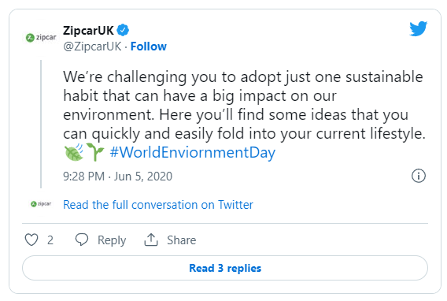

# Target Audience

These are the people who are most likely to be interested in your content, products, or services. They are likely united by some common characteristics, like demographics and behaviors.

You can start with broad categories like millennials or single dads. But good social media audience research will allow you to get into much finer detail.

You can sell to everyone, but you can’t target everyone with all of your social content. You can’t speak directly to your best potential customers if you’re trying to speak to their kids and parents and spouses and colleagues at the same time.

#### 1. What does this product/service solve for the target audience?

Identifying the problem or insufficiency your organization is responding to help to understand the groups which appeal to.

#### 2. Buying role of the target consumer?

- Initiator: The person who first suggests or thinks of the idea of buying the particular product or service

* Influencer: A person whose views influence other members of the buying centre in making the final decision

* Decider: The person who ultimately determines any part of or the entire buying decision-whether to buy, what to buy, how to buy, or where to buy;

* Buyer: The person who handles the paperwork of the actual purchase.

* User: The person(s) who consumes or uses the product or service.

* Gatekeeper: The person(s) who controls information or access, or both, to decision-makers and influencers.

* Age: You don’t need to get too specific here. Focus on learning which decade of life your social media target audience is in, or their generation.

### Market Segmentation

- Location (and time zone): Where in the world does your social media audience live? This helps you understand which geographic areas to target. You’ll also learn what hours are most important for your customer service and sales reps to be online. And when you should schedule your social ads and posts to ensure best visibility.

- Language: What language does your target audience speak? Don’t assume it’s your language. And don’t assume they speak the dominant language of their current physical location.

- Spending power and patterns: How much money does your target audience for social media sites have to spend? How do they approach purchases in your price category? Do they have specific financial concerns or preferences you need to address?

- Interests: What does your target audience like to do? What TV shows do they watch? What other businesses do they interact with?
  Challenges: What pain points is your social media audience dealing with?

- Stage of life: Does your social media target audience include college students? New parents? Parents of teens? Retirees?

### B2B companies should also consider:

- Size of business: What kinds of businesses buy from and engage with you? Are they start-ups or enterprise-level brands?

- Who tends to make the buying decisions: Are you targeting the CEO? The CTO? The social marketing manager?

### Examples

> “To urban-dwelling, educated, techno-savvy consumers who worry about the environment that future generations will inherit, Zipcar is the car-sharing service that lets you save money and reduce your carbon footprint, making you feel you’ve made a smart, responsible choice that demonstrates your commitment to protecting the environment.”

Notice that Zipcar is not targeting all residents of a particular city. They’re not even targeting all the people in a given city who don’t own a car. They’re specifically targeting people who:

- live in an urban area
- have a certain degree of education
- are comfortable will technology
- are concerned about the environment

These are all interests and behaviors that Zipcar can specifically target using social ads. They also help to guide the company’s overall approach to its social media marketing strategy. That’s clear in this thread about sustainable habits for World Environment Day.

### References

[Target Market](https://blog.hootsuite.com/target-market/)
