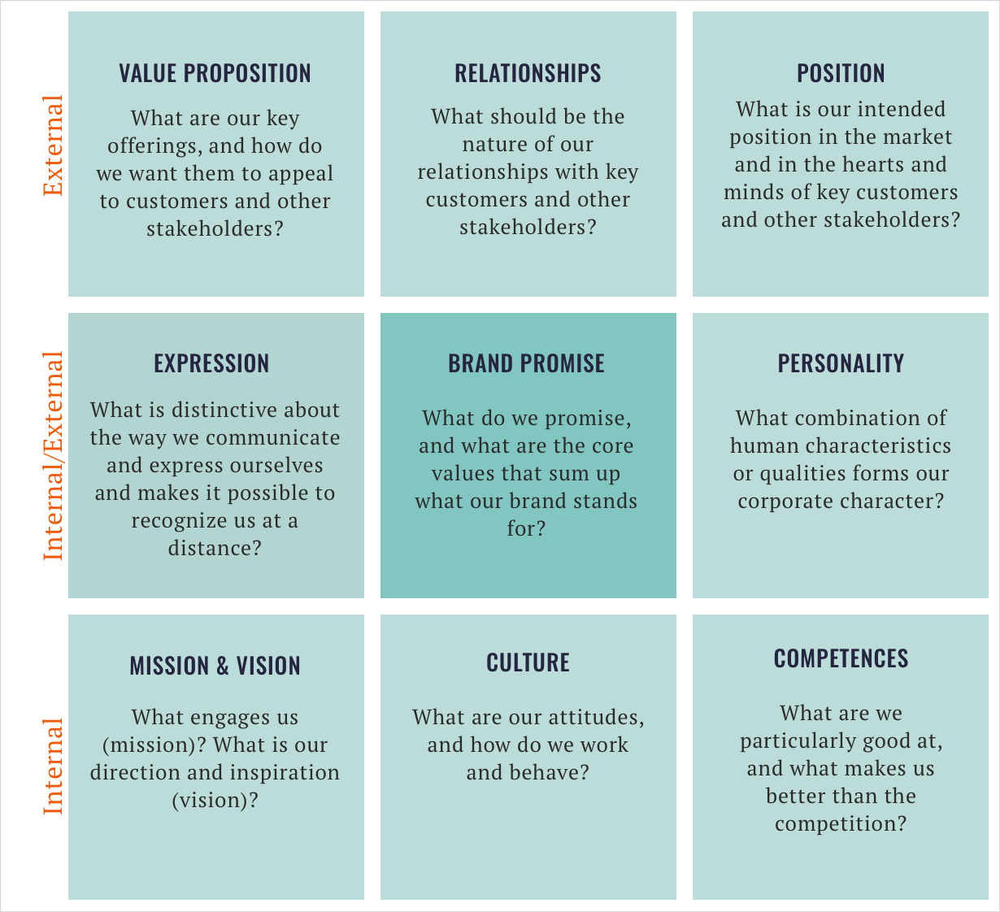

# The Corporate Brand Identity Matrix

A strong corporate identity provides direction and purpose, boosts the standing of products, aids in recruiting, and shores up a firm’s reputation. To help organizations define theirs, the authors have devised a tool called the corporate brand identity matrix. It guides teams through an examination of the nine components of corporate identity, which include mission, culture, relationships, and core values and promises. Often that exercise reveals broken links between the elements that executives need to align and strengthen.

 

 

## Strategy

The baroque diagonal focuses on

 
  

- Our mission is…
- Our vision is…
- What we promise is…
- Our core values are…
- Our intended position is the market is…

Do your mission and vision engage and inspire people in your own organization and, ideally, beyond it?

Do they translate into a promise that the organization will fulfill?

Is that promise manifest in the company’s positioning?

Finally, does the logic also flow in the other direction: Does your positioning resonate with your promise and values, which align with the corporate mission and vision?

## Competition

The sinister diagonal focuses on

 
 

- Our competences are…
- What we promise is…
- Our core values are…
- Our value proposition…

Do the items in the list above fit well together?

Do your current competences allow you to keep your promise and provide a solid basis for competitive and appealing value propositions?

## Interaction

THE vertical pass focuses on

 
 

Our culture is…
What we promise is…
Our core values are…
The kinds of relationships we strive for are…

This section reveals how well your organizational values and culture resonate with and engage people inside and outside your company. Employees are your most important resource for ensuring the authenticity of the corporate brand. If they don’t embrace these elements of your corporate identity, then your outside relationships, whether with customers, partners, or other stakeholders, will suffer.

## Communication

THE horizontal pass focuses on

 
 

Our corporate personality traits are…
What we promise is…
Our core values are…
Our communication style is…

The corporate personality or character underpins the company’s brand core and is expressed in myriad ways, from product design and the architecture of the headquarters to the corporate logo and marketing taglines. Assess how well that personality comes through in all communications, both internally and externally.

### References

[The Metrix](https://brandorientation.com/the-matrix/)

[What Does Your Corporate Brand Stand for?](https://hbr.org/2019/01/what-does-your-corporate-brand-stand-for)
