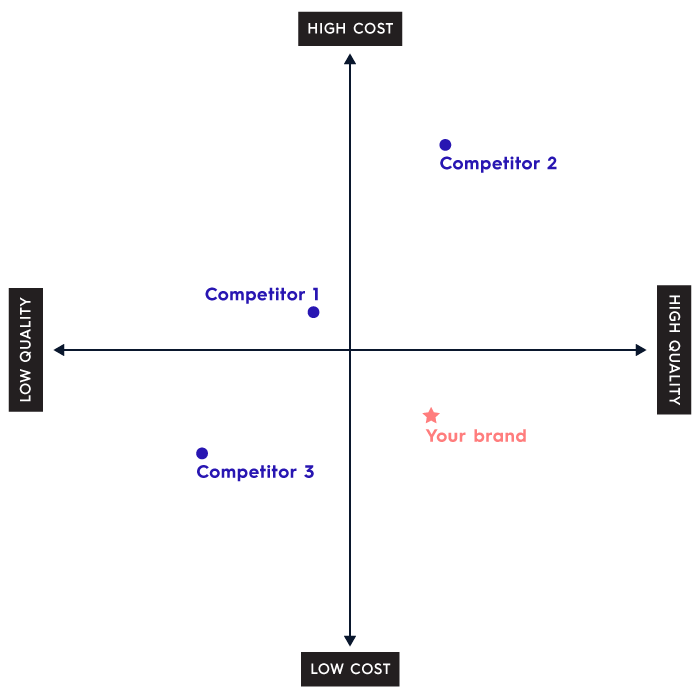

# Positioning

Positioning is a process to identify what boldly differentiates a brand in the mind of a customer. Customers are overwhelmed with choices. Positioning has the potential to create new openings in an oversaturated, continually changing marketplace. Effective brand positioning can extent to which a brand is perceived as favourable, different, and credible in consumers minds. Simply put it's about identifing the `GAP` in the market.

#### 01. Positioning Strategy

- Customer Service Positioning Strategy
- Convenience-Based Positioning Strategy
- Price-Based Positioning Strategy
- Quality-Based Positioning Strategy
- Differentiation Strategy

#### 02. The Onlyness statement?

> Our `offering` is the only `catagroy` that `benefit`.

#### 03. What do you want your customers to think when they think of your brand?

An adjective or a word describing the first expression.

#### 04. How are we different from our competitors?

One single point that makes their product or service different from the rest.

#### 05. Unique Selling Proposition?

We offer `PRODUCT/SERVICE` for `TARGET MARKET` to `VALUE PROPOSITION`.
Unlike `THE ALTERNATIVE`, we `KEY DIFFERENTIATOR`.

## Examples

> We offer water bottles for hikers to stay hydrated, while reducing their carbon footprint. Unlike other water bottle brands, we plant a tree for every bottle you buy.

[<- Previous Page](./messaging.md)
|
[Next Page ->](./metrix.md)

### References

[How To Build A Brand](https://www.shopify.com/blog/how-to-build-a-brand)

[Brand Positioning Statement](https://www.risefuel.com/blog/what-is-a-positioning-statement)
