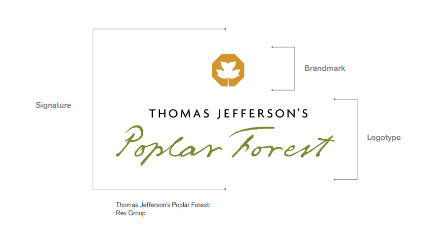

# Logotype

A logotype is a word or words in a determine font, which may be standard, modified, or entirely redrawn. Logotypes need to be not only distinctive, but durable and sustainable. Legibility at various scales and in a range of media is imperative, whether a logotype is silk-screened on the side of a ballpoint pen or illuminated in an external sign twenty stories off the ground.

## Implementation Structure

[Next Page ->](./index.md)

### References

[Designing Brand Identity](https://www.designingbrandidentity.info)
